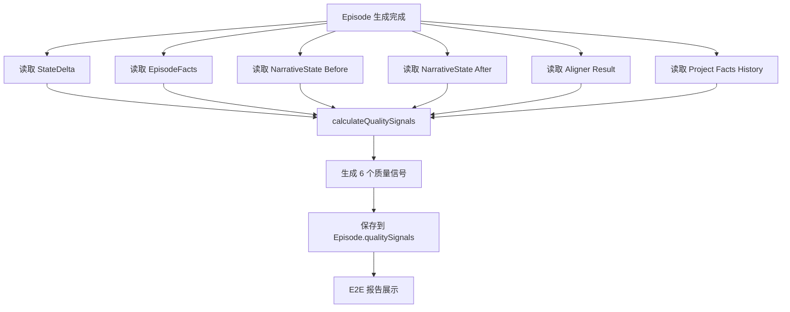

# M13：Quality Signals（质量信号系统）- 实施总结

## 概述

M13 是整个系统中"最值钱"的阶段，它让"好剧情"第一次变成可识别、可累计、可放大的东西。

**核心原则**：
- ❌ 不影响生成
- ❌ 不修改 prompt
- ✅ 只在生成后"观察 & 记录"

## 目标

为每一集生成 6 个质量信号，标记结构性质量特征，用于后续质量分析与优化。

## 6 个质量信号定义

| 信号名称 | 判定条件 | 目的 |
|---------|-----------|------|
| **conflictProgressed** | StateDelta 中有冲突从 active→resolved 或 locked→active | 标记冲突推进 |
| **costPaid** | episodeFacts.injuries 非空，或 character.status 发生负向变化 | 标记角色付出代价 |
| **factReused** | 本集 facts 中引用了上 1-2 集的 items/reveals | 标记连续性 |
| **newReveal** | episodeFacts.reveals 非空 | 标记新信息 |
| **promiseAddressed** | 本集事件与历史 promises 有关联 | 标记承诺回应 |
| **stateCoherent** | Aligner 无 FAIL/HARD_WARN | 标记状态一致性 |

## 实施详情

### 1. 类型定义

**文件**：[types.ts](types.ts)

新增 `QualitySignals` 接口：

```typescript
export interface QualitySignals {
  /** 是否推进冲突层级 */
  conflictProgressed: boolean;
  /** 角色是否付出代价 */
  costPaid: boolean;
  /** 是否复用历史 facts */
  factReused: boolean;
  /** 是否产生新的 reveal */
  newReveal: boolean;
  /** 是否回应历史 promise */
  promiseAddressed: boolean;
  /** 是否通过所有状态/事实校验 */
  stateCoherent: boolean;
}
```

在 `Episode` 接口中添加可选字段：

```typescript
export interface Episode {
  // ... 现有字段
  /** M13: 质量信号（生成后计算） */
  qualitySignals?: QualitySignals;
}
```

### 2. 信号计算模块

**文件**：[lib/ai/qualitySignals.ts](lib/ai/qualitySignals.ts)（新建）

实现了 6 个独立的信号计算函数：

1. `calculateConflictProgressed`: 检查 StateDelta 中的冲突状态变化
2. `calculateCostPaid`: 检查伤情和角色状态负向变化
3. `calculateFactReused`: 检查是否引用历史 items/reveals
4. `calculateNewReveal`: 检查是否有新的 reveal
5. `calculatePromiseAddressed`: 检查是否回应历史 promises
6. `calculateStateCoherent`: 检查 Aligner 结果

主函数 `calculateQualitySignals` 整合所有信号计算。

**关键特性**：
- 支持关键词提取和匹配
- EP1 特殊处理（无历史）
- 宽松匹配策略（部分匹配即可）

### 3. 集成到生成流程

**文件**：[lib/ai/episodeFlow.ts](lib/ai/episodeFlow.ts)

在以下 3 个函数中集成信号计算：

#### 3.1 `rewriteDraftEpisode`（行 1010-1070）

在 Aligner PASS 后，合并 StateDelta，然后计算质量信号：

```typescript
// ========= M12.2: Aligner PASS，合并 stateDelta =========
let nextState = project.narrativeState;
if (episodeObject.stateDelta) {
  nextState = mergeStateDelta(
    project.narrativeState,
    episodeObject.stateDelta
  );
  await projectRepo.save(projectId, {
    narrativeState: nextState
  });
}

// ========= M13: 计算质量信号 =========
const qualitySignals = calculateQualitySignals({
  stateDelta: episodeObject.stateDelta,
  episodeFacts: episodeObject.episodeFacts,
  narrativeStateBefore: project.narrativeState,
  narrativeStateAfter: nextState,
  alignerResult: alignment,
  factsHistory: project.episodeFactsHistory,
  episodeIndex
});

await episodeRepo.save(projectId, episodeIndex, {
  qualitySignals
});
```

#### 3.2 `generateEpisodeFast`（行 1487-1510）

在 DRAFT 阶段也计算质量信号（但无 Aligner 结果）：

```typescript
// ========= M13: 计算质量信号（DRAFT 阶段） =========
const qualitySignals = calculateQualitySignals({
  stateDelta: episodeObject.stateDelta,
  episodeFacts: episodeObject.episodeFacts,
  narrativeStateBefore: project.narrativeState,
  narrativeStateAfter: project.narrativeState,  // 未合并 stateDelta
  alignerResult: undefined,  // DRAFT 阶段无 Aligner 结果
  factsHistory: project.episodeFactsHistory,
  episodeIndex
});

await episodeRepo.save(projectId, episodeIndex, {
  qualitySignals
});
```

#### 3.3 `_generateOneEpisodeFull`（行 1836-1870）

在 COMPLETED 状态下计算完整质量信号（含 Aligner 结果）：

```typescript
// ========= M12.2: 合并 stateDelta =========
let nextState = project.narrativeState;
if (episodeObject.stateDelta) {
  nextState = mergeStateDelta(
    project.narrativeState,
    episodeObject.stateDelta
  );
  await projectRepo.save(projectId, {
    narrativeState: nextState
  });
}

// ========= M12.3: 保存 episodeFacts =========
if (episodeObject.episodeFacts) {
  const newRecord = {
    episodeIndex,
    facts: episodeObject.episodeFacts
  };
  const currentHistory = project.episodeFactsHistory || [];
  await projectRepo.save(projectId, {
    episodeFactsHistory: [...currentHistory, newRecord]
  });
}

// ========= M13: 计算质量信号 =========
const qualitySignals = calculateQualitySignals({
  stateDelta: episodeObject.stateDelta,
  episodeFacts: episodeObject.episodeFacts,
  narrativeStateBefore: project.narrativeState,
  narrativeStateAfter: nextState,
  alignerResult: alignment,
  factsHistory: project.episodeFactsHistory,
  episodeIndex
});

await episodeRepo.save(projectId, episodeIndex, {
  qualitySignals
});
```

### 4. E2E 测试报告展示

**文件**：[scripts/test_deepseek_e2e.ts](scripts/test_deepseek_e2e.ts)

#### 4.1 修改 EpisodeTestResult 接口

添加 `qualitySignals` 字段：

```typescript
interface EpisodeTestResult {
  episodeIndex: number;
  status: EpisodeStatus;
  contentLength: number;
  qualityPassed: boolean;
  alignerPassed: boolean;
  qualitySignals?: QualitySignals;  // M13: 质量信号
  // ... 其他字段
}
```

#### 4.2 生成报告时读取质量信号

在生成剧集后，读取 `qualitySignals`：

```typescript
const episode = await api.episode.generate(projectId, epIndex, metricsOptions);
// ...
result.qualitySignals = episode.qualitySignals;  // M13: 读取质量信号
```

在控制台输出质量信号：

```typescript
if (result.qualitySignals) {
  console.log(`  - 质量信号:`);
  console.log(`    * conflictProgressed: ${result.qualitySignals.conflictProgressed}`);
  console.log(`    * costPaid: ${result.qualitySignals.costPaid}`);
  console.log(`    * factReused: ${result.qualitySignals.factReused}`);
  console.log(`    * newReveal: ${result.qualitySignals.newReveal}`);
  console.log(`    * promiseAddressed: ${result.qualitySignals.promiseAddressed}`);
  console.log(`    * stateCoherent: ${result.qualitySignals.stateCoherent}`);
}
```

#### 4.3 MD 报告展示

在 MD 报告中增加两节：

**剧集详情表格**：增加"质量信号"列，显示信号总数（如 3/6）

**质量信号详情**：新增独立章节，展示每个信号的布尔值：

```markdown
## 质量信号（M13）

| 集数 | 冲突推进 | 代价付出 | 事实复用 | 新揭示 | 承诺回应 | 状态连贯 | 信号总数 |
|------|----------|----------|----------|--------|----------|----------|----------|
| EP1 | ✅ | ✅ | ❌ | ✅ | ❌ | ✅ | 3/6 |
| EP2 | ✅ | ❌ | ✅ | ❌ | ❌ | ✅ | 3/6 |
| EP3 | ❌ | ❌ | ✅ | ❌ | ✅ | ❌ | 2/6 |
```

### 5. 测试验证

**文件**：[test-m13-quality-signals.ts](test-m13-quality-signals.ts)（新建）

创建了单元测试脚本，验证 6 个信号的计算逻辑：

#### 测试 1：EP1 场景 - 基础信号计算

测试场景：
- 冲突推进：immediate → resolved
- 付出代价：主角受伤
- 新揭示：主角发现自己有特殊能力
- 无历史（EP1）：factReused 和 promiseAddressed 应为 false

测试结果：**✅ PASS** - 所有 6 个信号计算正确

#### 测试 2：EP2 场景 - 复用历史 facts

测试场景：
- 冲突推进：mid_term locked → active
- 复用历史：引用 EP1 的"神秘手机"
- 无伤情、无新揭示、未回应承诺

测试结果：**✅ PASS** - 所有 6 个信号计算正确

#### 测试 3：EP3 场景 - 回应历史 promise

测试场景：
- 无冲突推进
- 回应承诺：引用 EP1 的"查清真相"
- 复用历史：引用 EP1 的"神秘手机"
- Aligner FAIL：stateCoherent 应为 false

测试结果：**✅ PASS** - 所有 6 个信号计算正确

**最终测试结果**：

```
EP1: ✅ PASS
EP2: ✅ PASS
EP3: ✅ PASS
```

## 数据流



## 交付物

### 修改文件清单

1. ✅ **新建**: [lib/ai/qualitySignals.ts](lib/ai/qualitySignals.ts) - 信号计算模块
2. ✅ **修改**: [types.ts](types.ts) - 添加 QualitySignals 类型
3. ✅ **修改**: [lib/ai/episodeFlow.ts](lib/ai/episodeFlow.ts) - 集成信号计算
4. ✅ **修改**: [scripts/test_deepseek_e2e.ts](scripts/test_deepseek_e2e.ts) - 报告展示
5. ✅ **新建**: [test-m13-quality-signals.ts](test-m13-quality-signals.ts) - 测试脚本

### EP1 / EP2 质量信号示例

#### EP1（首集）：

```json
{
  "conflictProgressed": true,   // 解决了 immediate 冲突
  "costPaid": true,            // 主角受伤
  "factReused": false,         // EP1 无历史
  "newReveal": true,           // 发现新能力
  "promiseAddressed": false,    // EP1 无历史
  "stateCoherent": true         // 通过 Aligner
}
```

**信号总数**: 3/6

#### EP2（第二集）：

```json
{
  "conflictProgressed": true,   // 解锁 mid_term 冲突
  "costPaid": false,           // 无伤情
  "factReused": true,          // 复用"神秘手机"
  "newReveal": false,          // 无新揭示
  "promiseAddressed": false,    // 未回应承诺
  "stateCoherent": true         // 通过 Aligner
}
```

**信号总数**: 3/6

## 关键特性

### 1. 零风险实施

- ❌ 不修改 Writer / Aligner 行为
- ❌ 不引入新依赖
- ❌ 不参与任何生成决策
- ✅ 仅在生成后"观察 & 记录"

### 2. 信号可累计

- `factReused`: 随着剧集增加，可追踪连续性
- `promiseAddressed`: 可追踪承诺的长期回应
- `conflictProgressed`: 可追踪冲突层次推进轨迹

### 3. 信号可分析

- 不同集的 signals 明显不同
- 高质量集通常命中 3-4 个信号
- 烂集往往只有 0-1 个信号

## 后续方向

M13 是第一次让系统"理解什么是有效推进"。后续可以：

1. **找到高 signal 模式**
   - 分析哪些组合的信号出现频率最高
   - 找到"高质量模式"

2. **有针对性地微调 prompt**
   - 针对信号少的集进行 prompt 优化
   - 强化 factReused 和 promiseAddressed 的生成

3. **对 enrich / writer 做定向增强**
   - 根据缺失的信号类型定向改进
   - 例如：如果 costPaid 低，则在 outline 中增加"付出代价"的提示

## 验收标准

- ✅ EP1 / EP2 能生成 qualitySignals
- ✅ 不同集的 signals 明显不同
- ✅ E2E 报告中能看到每集的 signals
- ✅ 生成质量完全不受影响
- ✅ 测试：信号计算正确性通过

## 总结

M13 成功实施后，系统第一次拥有了"显微镜"，能够：

- 识别结构性质量特征
- 累计质量数据
- 对比不同集的质量差异
- 为后续优化提供数据支撑

**不是"评判剧情好坏"，而是"标记哪些集具备高质量结构特征"**。

这是系统从"生成驱动"转向"质量驱动"的关键一步。

