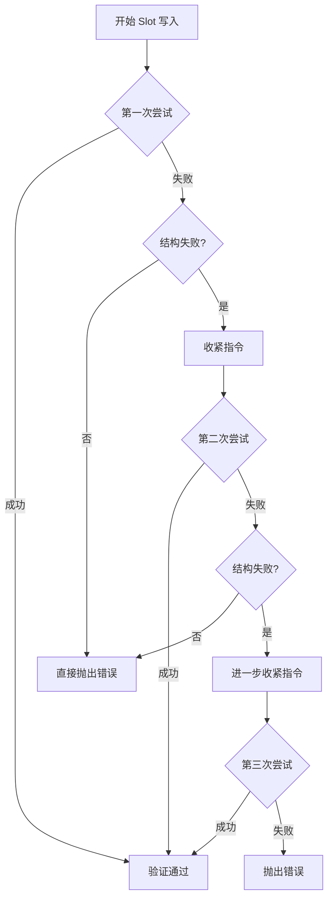
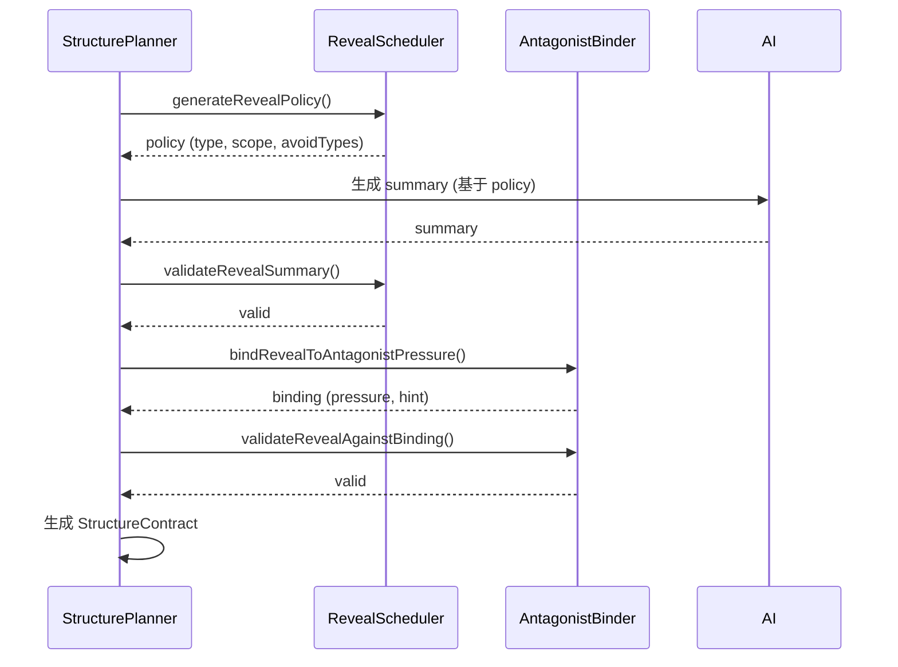

# M16.3 Reveal Scheduler & Antagonist Binding & Structure Retry

## 概述

M16.3 从 M16.2 的"结构必有"(0/1 问题)升级到"结构可控"(质量问题),实现三个核心功能:
1. **Reveal Scheduler** - 决定每集 Reveal 的类型分布与密度
2. **Antagonist Ladder Binder** - Reveal 必须挂钩反派升级/压迫升级
3. **Structure Retry Loop** - Slot FAIL 自动重试(但仍禁止 fallback)

---

## 1. Reveal Scheduler - Reveal 调度器

### 1.1 目标

- 决定每集 Reveal 的类型分布与密度
- 实现类型轮换策略,避免连续重复
- 生成去重 key,防止同义重复

### 1.2 核心类型

```typescript
export type RevealType = 'FACT' | 'INFO' | 'RELATION' | 'IDENTITY';
```

- **FACT**: 事实类揭示(具体的、可验证的事实)
- **INFO**: 信息类揭示(情报、消息、知识)
- **RELATION**: 关系类揭示(角色关系变化、站队)
- **IDENTITY**: 身份类揭示(身份曝光、真实面目)

### 1.3 调度策略

#### 硬规则

- EP1: required=false(不变)
- EP2+: required=true(不变)

#### 类型分布建议

默认策略按集数分配类型:

| 集数范围 | 推荐类型 | 说明 |
|---------|---------|------|
| EP2/3 | INFO, FACT | 推进世界观与局势 |
| EP4/5 | RELATION, INFO, FACT | 引爆人际与站队 |
| EP6 | IDENTITY, RELATION | 阶段性大爆点 |

#### 轮换规则

- 循环使用,但禁止连续两集同 type
- 通过 `avoidTypes` 参数传递最近类型
- 自动过滤掉连续相同的类型

### 1.4 核心函数

#### scheduleRevealType

```typescript
scheduleRevealType(
  episode: number,
  recentTypes: RevealType[],
  history: RevealHistory[] = []
): RevealType
```

根据集数和最近类型,调度合适的 Reveal 类型。

#### generateNoRepeatKey

```typescript
generateNoRepeatKey(summary: string): string
```

基于 summary 生成唯一标识符,用于去重。使用 SHA256 hash,取前16位。

#### hasRevealKey

```typescript
hasRevealKey(history: RevealHistory[], key: string): boolean
```

检查 key 是否已存在于历史记录中。

#### appendRevealToHistory

```typescript
appendRevealToHistory(
  history: RevealHistory[],
  entry: RevealHistory
): RevealHistory[]
```

将新的 Reveal 记录追加到历史中。

### 1.5 使用示例

```typescript
import {
  scheduleRevealType,
  generateNoRepeatKey,
  appendRevealToHistory,
  hasRevealKey
} from './lib/ai/revealScheduler';

// 调度 EP2 的 Reveal 类型
const recentTypes = getRecentRevealTypes(history, 2);
const type = scheduleRevealType(2, recentTypes, history);

// 生成去重 key
const summary = '主角发现修仙功法是失传绝学';
const noRepeatKey = generateNoRepeatKey(summary);

// 检查是否重复
if (hasRevealKey(history, noRepeatKey)) {
  throw new Error('Duplicate reveal detected');
}

// 追加到历史
const entry: RevealHistory = {
  episode: 2,
  type: 'FACT',
  scope: 'PROTAGONIST',
  summary,
  noRepeatKey
};
history = appendRevealToHistory(history, entry);
```

---

## 2. Antagonist Binder - 反派阶梯绑定

### 2.1 目标

- 将 Reveal 绑定到反派升级/压迫升级/资源门槛升级
- 确保每集 Reveal 挂钩明确的压力变化
- 生成压力向量(PressureVector)和提示(hint)

### 2.2 压力向量类型

```typescript
export type PressureVector = 'POWER' | 'RESOURCE' | 'STATUS' | 'RELATION' | 'LIFE_THREAT';
```

- **POWER**: 力量压迫(能力、实力、压制)
- **RESOURCE**: 资源压迫(金钱、情报、物品、人脉)
- **STATUS**: 地位压迫(阶级、权威、影响力)
- **RELATION**: 关系压迫(盟友、敌人、背叛)
- **LIFE_THREAT**: 生存威胁(生命、危险、死亡)

### 2.3 绑定策略

根据 Reveal 类型和作用域生成压力向量:

| Reveal 类型 | 作用域 | 推荐压力向量 |
|-----------|--------|-------------|
| FACT | WORLD | POWER (世界观事实带来力量格局变化) |
| FACT | PROTAGONIST/ANTAGONIST | RESOURCE (角色事实涉及资源变化) |
| INFO | ANTAGONIST | STATUS (反派信息带来地位威胁) |
| INFO | PROTAGONIST/WORLD | RELATION (角色信息影响关系) |
| RELATION | 任意 | RELATION (直接关系压力) |
| IDENTITY | EP6+ | LIFE_THREAT (后期身份揭秘威胁生命) |
| IDENTITY | EP2-5 | POWER (前期身份揭秘带来力量变化) |

### 2.4 压力提示生成

每个压力向量都有对应的提示,指导 Writer 如何在 summary 中体现压力:

**POWER 示例提示**:
```
本 Reveal 必须明确展示力量的此消彼长,主角或反派的力量地位发生实质性变化。
要求:使用具体的事件或能力展示,而非抽象描述。
影响:后续决策必须考虑新的力量格局。
```

**RESOURCE 示例提示**:
```
本 Reveal 必须涉及资源的获取、失去或重新分配。
要求:明确指出资源类型(金钱、情报、物品、人脉等)。
影响:后续行动必须受到资源状况的约束。
```

### 2.5 核心函数

#### bindRevealToAntagonistPressure

```typescript
bindRevealToAntagonistPressure(args: {
  episode: number;
  revealType: RevealType;
  revealScope: 'PROTAGONIST' | 'ANTAGONIST' | 'WORLD';
  project: any;
  outline: any;
}): AntagonistPressureBinding
```

将 Reveal 绑定到反派压力,返回压力向量和提示。

#### validateRevealAgainstBinding

```typescript
validateRevealAgainstBinding(
  summary: string,
  binding: AntagonistPressureBinding
): { valid: boolean; error?: string }
```

验证 Reveal summary 是否符合压力绑定要求(是否包含对应的关键词)。

### 2.6 使用示例

```typescript
import {
  bindRevealToAntagonistPressure,
  validateRevealAgainstBinding
} from './lib/ai/antagonistBinder';

// 绑定 Reveal 到反派压力
const binding = bindRevealToAntagonistPressure({
  episode: 3,
  revealType: 'INFO',
  revealScope: 'ANTAGONIST',
  project,
  outline
});

// { pressure: 'STATUS', hint: '...' }

// 验证 summary
const summary = '主角发现反派的真实身份,地位受到威胁';
const validation = validateRevealAgainstBinding(summary, binding);

if (!validation.valid) {
  console.error(validation.error);
  // 需要重新生成 summary
}
```

---

## 3. Structure Retry Loop - 结构重试闭环

### 3.1 目标

- Slot FAIL 自动重试(但仍禁止 fallback)
- 每次重试"收紧指令"而不是重复同一句话
- 最多重试 3 次,仍不 fallback

### 3.2 重试配置

```typescript
const MAX_SLOT_RETRIES = 3;
```

### 3.3 重试逻辑



### 3.4 指令收紧策略

#### 第一次重试 (Attempt 2)

加粗必须出现的事实句:
```
【重试提示】必须明确出现"发现/证据/当场验证"等表达,禁止模糊暗示。
```

#### 第二次重试 (Attempt 3)

强制使用特定词汇:
```
【最终重试】必须使用以下词汇:发现、证实、证据、验证、当场。
```

### 3.5 为什么不 fallback?

M16 铁律: **失败优于兜底**

理由:
1. **保持信号清晰**: fallback 会掩盖真实的失败原因
2. **避免污染系统**: 兜底内容可能不符合商业标准
3. **强制修复**: 失败即停止,迫使修复根本问题
4. **保持数据一致**: 防止不一致的内容进入系统

---

## 4. 集成到 StructureContract

### 4.1 扩展字段

```typescript
export interface StructureContract {
  episode: number;
  mustHave: {
    newReveal: {
      required: boolean;
      type: RevealType;
      scope: 'PROTAGONIST' | 'ANTAGONIST' | 'WORLD';
      summary: string;
      // M16.3 新增字段
      cadenceTag?: 'NORMAL' | 'SPIKE';
      noRepeatKey?: string;
      pressureVector?: string;
      pressureHint?: string;
    };
  };
  optional: {
    conflictProgressed?: boolean;
    costPaid?: boolean;
  };
}
```

### 4.2 字段说明

| 字段 | 类型 | 说明 | 来源 |
|-----|------|------|
| cadenceTag | 'NORMAL' \| 'SPIKE' | 调度标签,EP6 为 SPIKE | revealScheduler |
| noRepeatKey | string | 去重 key,防止同义重复 | revealScheduler (generateNoRepeatKey) |
| pressureVector | string | 压力向量,挂钩反派升级 | antagonistBinder |
| pressureHint | string | 压力提示,指导 Writer | antagonistBinder |

### 4.3 生成流程



---

## 5. Reveal 质量信号

### 5.1 目标

用于 post-check,仅用于评分与分析,不参与结构 gate

### 5.2 质量信号

```typescript
export interface RevealQualitySignal {
  revealIsConcrete: boolean;      // 是否可验证(避免"模糊暗示")
  revealHasConsequence: boolean;   // 是否在本集/下集可触发行动
}
```

### 5.3 检查逻辑

#### revealIsConcrete

检查内容中是否包含:
- **明确验证词**: 发现、证据、当场、验证、证实、确认、亲眼看到、亲耳听到
- **不包含模糊词**: 似乎、可能、好像、感觉、大概、也许、朦胧、模糊

#### revealHasConsequence

检查内容中是否包含:
- **行动相关词**: 决定、行动、计划、必须、不得不、被迫、立即、马上
- **后续影响**: summary 或下集大纲中引用了本集 Reveal 的内容

### 5.4 使用示例

```typescript
import { checkRevealQualitySignals } from './lib/ai/alignerRunner';

// 检查 Reveal 质量信号
const signal = checkRevealQualitySignals({
  content: episodeContent,
  structureContract,
  episodeIndex: 3,
  project
});

// {
//   revealIsConcrete: true,
//   revealHasConsequence: true
// }

// 仅用于评分与分析
if (!signal.revealIsConcrete) {
  console.warn('Reveal is not concrete, may need review');
}
```

---

## 6. 验收标准

### 6.1 功能验收

- [x] EP2+: New Reveal 必有(M16.2 已完成)
- [ ] EP2-EP6 连续集 RevealType 不重复
- [ ] Reveal summary 不可重复
- [ ] Structure fail 自动重试 ≤3 次,仍不 fallback
- [ ] CI 上 test:m16 与 test:m16.3 必须都绿

### 6.2 输出验收

运行测试后需要输出:
1. `npm run test:m16` 的终端输出(完整)
2. `npm run test:m16.3` 的终端输出(完整)
3. 生成 EP2-EP6 的 StructureContract.mustHave.newReveal(type+summary 列表)

---

## 7. 运行测试

### 7.1 运行 M16 测试

```bash
npm run test:m16
```

### 7.2 运行 M16.3 测试

```bash
npm run test:m16.3
```

### 7.3 预期结果

两个测试都应该通过,输出类似:

```
✓ TEST PASSED
  - Type Rotation: ✓
  - Duplicate Key Prevention: ✓
  - Retry Mechanism: ✓

✓ M16.3 Reveal Scheduler & Antagonist Binding 实施成功！
```

---

## 8. 注意事项

### 8.1 重试与 Fallback 的区别

| 特性 | 重试 | Fallback |
|-----|------|---------|
| 目的 | 修正结构失败 | 避免生成失败 |
| 次数 | 最多 3 次 | 无限或 1 次 |
| 指令 | 逐次收紧 | 使用不同策略 |
| 失败处理 | 仍失败则抛出错误 | 返回兜底内容 |
| M16 铁律 | 允许 | **禁止** |

### 8.2 去重机制

- 基于 summary 的 SHA256 hash 生成唯一 key
- 历史记录在 `Project.revealHistory` 中维护
- 在生成 StructureContract 时检查,防止重复

### 8.3 类型轮换

- 默认策略按集数分配类型
- 禁止连续两集相同
- 可通过配置或扩展实现更智能的策略

---

## 9. 相关文件

- `lib/ai/revealScheduler.ts` - Reveal 调度器实现
- `lib/ai/antagonistBinder.ts` - 反派阶梯绑定实现
- `lib/ai/structurePlanner.ts` - 结构规划器(已集成 revealScheduler 和 antagonistBinder)
- `lib/ai/episodeFlow.ts` - 剧集生成流程(已集成重试逻辑)
- `lib/ai/alignerRunner.ts` - Aligner(已集成 Reveal 质量信号)
- `types.ts` - 类型定义(已添加 RevealHistory)
- `scripts/test-m16-3-reveal-scheduler.ts` - M16.3 测试脚本

---

## 10. 后续优化方向

1. **更智能的类型调度**: 基于剧情发展动态选择最合适的类型
2. **更精细的压力绑定**: 考虑更多维度(情感、心理等)
3. **重试策略优化**: 根据失败类型动态调整重试策略
4. **质量信号扩展**: 增加更多维度的质量检测
5. **可视化工具**: 提供 Reveal 节奏和压力曲线的可视化界面

---

## 文档版本

- 版本: M16.3
- 日期: 2026-01-03
- 作者: Cursor AI Assistant

